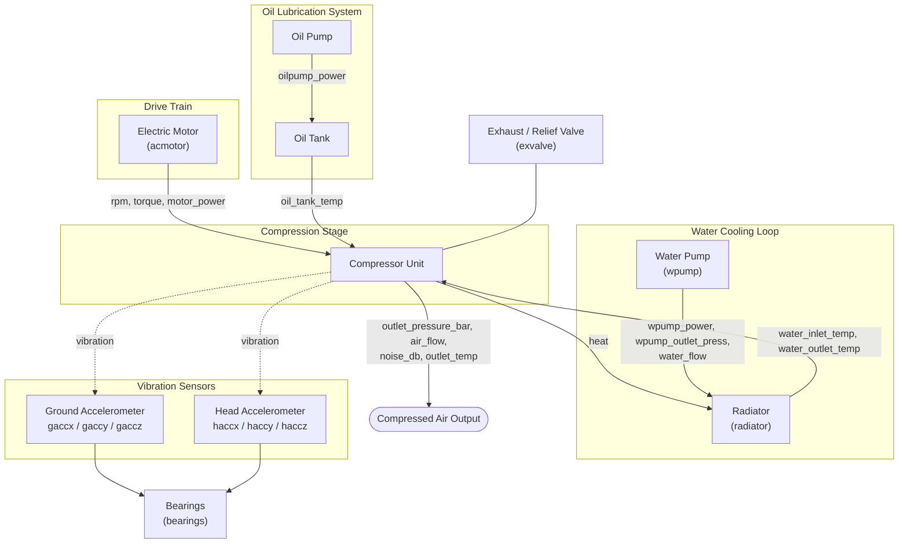

# Air Compressor System Architecture

📚 **Docs:** [README](../README.md) · [Architecture](ARCHITECTURE.md) · [Concepts](CONCEPTS.md)

This document explains the **physical machine** being monitored in this project — its
subsystems, what each of the 26 dataset columns physically measures, and how those
parameters causally relate to one another. Where possible, relationships are backed by
actual correlation numbers computed from `data/raw/aircompressor.csv` (1000 rows), not
just theory — so this doubles as a data dictionary. For the *software*/ML concepts built
on top of this data, see [CONCEPTS.md](CONCEPTS.md).

---

## 1. What the Machine Does

An industrial air compressor takes in atmospheric air and mechanically compresses it to
a higher pressure so it can power pneumatic tools, actuators, or other machinery on a
factory line. Compressing a gas generates a lot of heat and mechanical stress, so a real
unit is really **four coupled subsystems**, not one:

1. **Drive train** — an electric motor spins the compressor.
2. **Compression stage** — the compressor itself turns motor torque into pressurized air.
3. **Water cooling loop** — circulates coolant to remove the heat generated by compression.
4. **Oil lubrication system** — keeps moving parts (especially bearings) friction-free.

A fifth "subsystem" isn't mechanical — it's the **vibration monitoring** layer
(accelerometers) bolted onto the machine to listen for early signs of mechanical wear,
particularly in the bearings.

Failure is tracked per-component: `bearings`, `wpump` (water pump), `radiator`, and
`exvalve` (exhaust/relief valve) each have their own binary fault flag, because in a real
plant these are usually replaced/serviced independently.

---

## 2. Subsystem Diagram



Solid arrows are direct causal/energy-flow relationships; dotted arrows are sensing
relationships (the accelerometer *observes* the compressor, it doesn't drive it).

---

## 3. Subsystem-by-Subsystem Parameter Reference

### 3.1 Drive Train — Motor → Compressor

| Column | Unit | What it measures |
|---|---|---|
| `rpm` | rotations/min | Motor shaft speed |
| `motor_power` | kW | Electrical power the motor is drawing |
| `torque` | N·m | Rotational force the motor delivers to the compressor |
| `acmotor` | categorical | Motor status label (`"Stable"` for every one of the 1000 rows in this dataset — i.e. it carries **no variance** here; it's a placeholder for a state that isn't actually exercised by this data) |

**Relationships:** `rpm`, `motor_power`, and `torque` are three views of the same
underlying mechanical work, related by the standard rotational-power identity —
power equals torque times angular velocity, $\omega = \frac{2\pi \cdot \text{rpm}}{60}$
(converting revolutions/min to radians/sec):

$$
P = \tau \cdot \omega = \tau \cdot \frac{2\pi \cdot \text{rpm}}{60}
$$

so `motor_power` (in watts, if $\tau$ is in N·m) is *mechanically determined by* `torque`
and `rpm` together — it isn't an independent measurement, it's their product. In this
dataset, `torque` correlates strongly with `outlet_pressure_bar` (**r = 0.96**) — the
harder the compressor has to push air, the more torque the motor must supply — and `rpm`
correlates strongly with `noise_db` (**r = 0.91**) — faster spinning parts are audibly
louder. `rpm` also correlates *negatively* with the ground/head accelerometers (`gaccx`
**r = ‑0.90**, `haccx` **r = ‑0.89**): in this data, higher shaft speed corresponds to
*lower* X-axis vibration, likely because the unit runs smoother at its designed operating
speed and vibrates more at lower/irregular speeds.

> **Note on correlation, used throughout this document:** for two sensors $X, Y$ measured
> over $n$ rows, the Pearson correlation coefficient is
> $r_{XY} = \frac{\sum_{i=1}^{n}(x_i-\bar x)(y_i-\bar y)}{\sqrt{\sum_{i=1}^{n}(x_i-\bar x)^2}\sqrt{\sum_{i=1}^{n}(y_i-\bar y)^2}}$,
> with $r_{XY}\in[-1,1]$.
> $r=1$/$-1$ means a perfect increasing/decreasing linear relationship; $r=0$ means no
> *linear* relationship (there could still be a non-linear one).

### 3.2 Compression Stage — Air Output

| Column | Unit | What it measures |
|---|---|---|
| `outlet_pressure_bar` | bar | Pressure of the compressed air leaving the unit |
| `air_flow` | m³/min | Volumetric flow rate of compressed air delivered |
| `noise_db` | dB | Acoustic noise level of the running unit |
| `outlet_temp` | °C | Temperature of the air as it exits the compressor |

**Relationships:** Compressing a gas heats it. For an ideal gas under **adiabatic
compression** (no heat exchanged with surroundings during the compression stroke
itself), outlet temperature and pressure are linked by:

$$
\frac{T_2}{T_1} = \left(\frac{P_2}{P_1}\right)^{\frac{\gamma-1}{\gamma}}
$$

where $T_1, P_1$ are the inlet (atmospheric) temperature/pressure, $T_2, P_2$ are the
outlet values (`outlet_temp`, `outlet_pressure_bar`), and $\gamma$ is the gas's specific
heat ratio ($\gamma \approx 1.4$ for air) — the higher the compression ratio
$P_2/P_1$, the hotter the outlet air, before any cooling is applied. This is *why*
`outlet_temp` correlates with `oil_tank_temp` (**r = 0.98**) and both water-loop
temperatures (**r ≈ 0.98**): the same compression heat load raises the temperature of the
lubricant and the coolant simultaneously, downstream of this same physical process.
`rpm` correlates with `air_flow` (**r = 0.80**) — spinning faster physically pushes more
air through per minute.

### 3.3 Water Cooling Loop

| Column | Unit | What it measures |
|---|---|---|
| `wpump_outlet_press` | bar | Pressure of coolant leaving the water pump |
| `water_inlet_temp` | °C | Coolant temperature entering the cooling jacket/radiator |
| `water_outlet_temp` | °C | Coolant temperature after absorbing heat from the compressor |
| `wpump_power` | kW | Power draw of the water circulation pump |
| `water_flow` | m³/min | Coolant flow rate through the loop |
| `wpump` (target) | 0/1 | Water pump fault flag |

**Relationships:** `water_inlet_temp` and `water_outlet_temp` move almost in lockstep
(**r = 0.96**) — the outlet is always the inlet plus whatever heat it picked up. The
underlying physics is basic calorimetry: the heat $Q$ absorbed by the coolant per unit
time is proportional to the mass flow rate and the temperature rise across it,

$$
\dot{Q} = \dot{m} \, c_p \, (T_{\text{out}} - T_{\text{in}})
$$

where $\dot m$ is derived from `water_flow` (volumetric flow × density) and $c_p$ is
water's specific heat capacity. This means the temperature *delta*
$T_{\text{out}}-T_{\text{in}}$ (a feature not currently engineered anywhere in `src/`) is
itself a proxy for how much heat is being removed — i.e. cooling *effectiveness* — rather
than either raw temperature alone. `wpump_power` correlates with all three thermal
columns (`outlet_temp` **r = 0.87**, `oil_tank_temp` **r = 0.86**), meaning the pump works
harder (moves more $\dot m$) precisely when there's more heat $\dot Q$ to move —
consistent with a thermostatically/load-driven pump rather than a fixed-speed one.

The **radiator** fault flag is strongly tied to this loop specifically:
`radiator` correlates with `water_flow` at **r = ‑0.87** — a failing radiator is
associated with *reduced* coolant flow (consistent with a blocked/scaled radiator
restricting circulation) and with elevated water/oil temperatures (**r ≈ +0.32** on all
three), consistent with a radiator that can no longer shed heat effectively.

### 3.4 Oil Lubrication System

| Column | Unit | What it measures |
|---|---|---|
| `oilpump_power` | kW | Power draw of the oil circulation pump |
| `oil_tank_temp` | °C | Temperature of the lubricating oil reservoir |

**Relationships:** `oil_tank_temp` is one of the most thermally "central" sensors in the
dataset — it correlates with `outlet_temp` (**r = 0.98**), both water temperatures
(**r ≈ 0.97**), and `motor_power` (**r = 0.84**). Physically this makes sense: oil
circulates near the bearings and moving parts, so it picks up both compression heat and
frictional heat, making it a good aggregate "how hot is this machine running" signal.
Interestingly, `oilpump_power` and `oil_tank_temp` both have near-zero variance in this
dataset (std ≈ 0.4 kW and ≈ 0.2 °C respectively, vs. means of ~300 kW and ~46 °C) — they
barely move at all here, unlike every other continuous sensor, which limits how much
predictive signal they can realistically contribute despite their strong correlations.

### 3.5 Vibration Monitoring

| Column | Unit | What it measures |
|---|---|---|
| `gaccx`, `gaccy`, `gaccz` | m/s² | Acceleration at the compressor's **ground mounting point**, in 3 axes |
| `haccx`, `haccy`, `haccz` | g (gravitational units) | Acceleration at the compressor **head / upper cooling fin**, in 3 axes |
| `bearings` (target) | 0/1 | Bearing fault flag |

**Relationships:** Ground and head accelerometers are measuring the *same physical
vibration event* from two different mounting locations, which is why each axis pair is
almost perfectly correlated: `gaccz` ↔ `haccz` (**r = 0.998**), `gaccx` ↔ `haccx`
(**r = 0.99**) — using the Pearson formula from §3.1. This near-1:1 relationship is
exactly why `PdM-Approach.ipynb` collapses the 3 ground-axis readings into a single
scalar via the **vector magnitude (Euclidean norm)**:

```math
\text{ground\_acc\_mag} = \|\vec{g}\| = \sqrt{\text{gaccx}^2 + \text{gaccy}^2 + \text{gaccz}^2}
```

(see [CONCEPTS.md §8](CONCEPTS.md)) — the head sensors add almost no independent
information once the ground sensors are known, so using both sets directly would be
redundant for modeling.

The Z-axis in particular carries most of the compression-related signal: `gaccz`/`haccz`
correlate with `torque` (**r ≈ 0.97**) and `outlet_pressure_bar` (**r ≈ 0.95**) — i.e.
vibration in the Z direction scales with how hard the compressor is working, not just
with mechanical wear. This is why bearing degradation is better isolated by looking at
*rolling volatility* (rolling std, see `src/features.py`) or *frequency content* (FFT, see
`PdM-Approach.ipynb`) rather than the raw vibration level alone — the raw level is
confounded with normal operating load.

### 3.6 Fault / Target Columns

| Column | Meaning |
|---|---|
| `bearings` | 1 = bearing noise/wear detected, 0 = healthy |
| `wpump` | 1 = water pump fault, 0 = healthy |
| `radiator` | 1 = radiator fault, 0 = healthy |
| `exvalve` | 1 = exhaust/relief valve fault, 0 = healthy |
| `acmotor` | Motor state label; constant `"Stable"` in this dataset (see 3.1) |

**A key structural relationship the raw correlation table doesn't make obvious:** these
four fault columns are **mutually exclusive** in this dataset — summing them per row
gives either exactly `0` (200 rows, fully healthy) or exactly `1` (800 rows, exactly one
component faulted), never more than one fault at a time. Combined with each fault
individually affecting exactly 200/1000 rows (20%), this dataset is effectively a
**single-label, one-fault-at-a-time simulation** across 4 possible fault classes, dressed
up as 4 separate binary columns rather than one categorical column. Practically:
- Training a separate binary classifier per component (as `train.py` does for `bearings`)
  is a reasonable simplification, but each model is implicitly also learning "not one of
  the other 3 faults" as part of what "0" means.
- The pairwise correlation between any two fault columns is exactly **‑0.25**, and this
  is derivable rather than coincidental.

For two mutually-exclusive binary indicators $X, Y \in \{0,1\}$ each with marginal fault
probability $p$ (here $p=0.2$): mutual exclusivity means $X{=}1$ and $Y{=}1$ never happen
together, so $E[XY] = P(X{=}1, Y{=}1) = 0$. With $E[X]=E[Y]=p$ and
$\text{Var}(X)=\text{Var}(Y)=p(1-p)$ for a Bernoulli variable:

```math
r_{XY} = \frac{E[XY]-E[X]E[Y]}{\sqrt{\text{Var}(X)\text{Var}(Y)}} = \frac{0-p^2}{p(1-p)} = -\frac{p}{1-p}
```

Plugging in $p=0.2$: $r_{XY} = -\frac{0.2}{0.8} = -0.25$ — matching the observed value
exactly, confirming the four fault columns are baked-in mutually exclusive by
construction, not just empirically uncorrelated.

---

## 4. Cross-Cutting Relationship: The "Heat Cluster"

If you only remember one relationship from this document: **`outlet_temp`,
`oil_tank_temp`, `water_inlet_temp`, and `water_outlet_temp` all move together**
(pairwise correlations 0.96–0.98). They're four different sensors reading the
consequences of the same physical event — compression heat generation — filtered through
different parts of the machine (air path, lubrication, cooling water). When one rises
meaningfully more than the others, that divergence (not the absolute temperature) is the
actual anomaly signal — e.g. `radiator` faults show up as water/oil temps rising *while
`water_flow` drops*, which is a decoupling of the heat cluster, not just "everything got
hotter."

## 5. How This Feeds the Pipeline

- `src/train.py`'s `sensors` list (`rpm`, `motor_power`, `torque`, `outlet_pressure_bar`,
  `noise_db`, `outlet_temp`, `gaccx`, `haccx`) samples one representative column from each
  subsystem above rather than all 20 numeric columns — deliberately avoiding feeding in
  near-duplicate signals like `haccz`/`gaccz` (r = 0.998) or all four heat-cluster columns
  at once.
- `src/features.py`'s rolling mean/std and lag features are applied to exactly these
  subsystem-representative sensors, turning single-instant readings into short-term
  *trend* and *volatility* signals per subsystem.
- `src/preprocessing.py`'s `RobustScaler` matters most for the vibration and heat-cluster
  columns, since those are the ones prone to sudden spikes/outliers when a fault
  develops.

- Training a model does not make it servable. `src/train.py` registers each
  trained pipeline as a new candidate version in the MLflow Model Registry;
  `src/predict.py` only ever loads the version holding the `production`
  alias for a target. Attaching that alias is a separate, explicit step —
  `python -m src.promote promote <target> <version>` — so a bad retrain
  can't silently become what the API serves. See the README's "Promoting a
  Trained Model" section for the full workflow, and `src/promote.py` for
  the CLI (`list` / `promote` / `current`).

See [CONCEPTS.md](CONCEPTS.md) for how these parameters are turned into engineered
features, models, and a served prediction.
